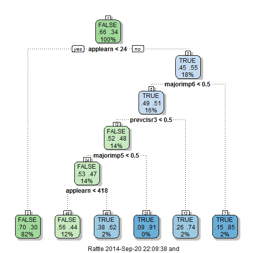

Case Success Identifier for Vocational Rehabilitation (VR)
========================================================
author: Aniruddha Das
date: date: September 20 2014

<small> 
Vocation Rehabilitation: https://www2.ed.gov/policy/speced/guid/rsa/pd-04-04.pdf
</small>

RSA911 Data
========================================================

Vocational Rehabilitation (VR) agencies provide support and services to persons with disabilities in the United States.

- Information about state VR agencies
- Demoggraphici information of clients
- Socio-economic information for clients for recieving services from VR agencies
    - Variables for wage, work-states etc. before receiving services
    - Variable for wage, work status etc. after receiving services

<small> data source: https://rsa.ed.gov/ad-hoc-query.cfm?mode=set-query-options&tbl=vw_911_by_dataset </small>

Methods
========================================================
- Researchers at ICL, UMass facilitated the data to be used for prediction.
- Snapshot of a subset of the data

```
    prevclsr    gender   white    black    aian     asian    nhpi    
 0      :5341   1:3586   0:1780   0:4763   0:6213   0:6241   0:6284  
 3      : 380   2:2735   1:4541   1:1558   1: 108   1:  80   1:  37  
 1      : 201                                                        
 4      : 186                                                        
 7      : 147                                                        
 2      :  41                                                        
 (Other):  25                                                        
    appleduc       majorimp       applwork       applearn   
 4      :2329   17     :1559   11     :4121   Min.   :   0  
 2      :1584   18     :1450   1      :1025   1st Qu.:   0  
 5      : 913   19     : 604   8      : 590   Median :   0  
 6      : 427   16     : 514   9      : 339   Mean   :  58  
 3      : 406   10     : 365   7      :  78   3rd Qu.:   0  
 7      : 322   13     : 339   5      :  71   Max.   :5770  
 (Other): 340   (Other):1490   (Other):  97                 
    applhour      outcome    
 Min.   : 0.00   FALSE:4141  
 1st Qu.: 0.00   TRUE :2180  
 Median : 0.00               
 Mean   : 5.48               
 3rd Qu.: 0.00               
 Max.   :70.00               
                             
```

Findings
========================================================
Classification and regression tree used for predicting case outcomes<br>
 

Summary/Next Steps
========================================================
- Improve the model prediction from 0.681

```r
modFitRpart$finalModel
```

```
n= 6321 

node), split, n, loss, yval, (yprob)
      * denotes terminal node

 1) root 6321 2180 FALSE (0.65512 0.34488)  
   2) applearn< 23.5 5159 1541 FALSE (0.70130 0.29870) *
   3) applearn>=23.5 1162  523 TRUE (0.45009 0.54991)  
     6) majorimp6< 0.5 1018  501 TRUE (0.49214 0.50786)  
      12) prevclsr3< 0.5 913  439 FALSE (0.51917 0.48083)  
        24) majorimp5< 0.5 890  418 FALSE (0.53034 0.46966)  
          48) applearn< 418 752  333 FALSE (0.55718 0.44282) *
          49) applearn>=418 138   53 TRUE (0.38406 0.61594) *
        25) majorimp5>=0.5 23    2 TRUE (0.08696 0.91304) *
      13) prevclsr3>=0.5 105   27 TRUE (0.25714 0.74286) *
     7) majorimp6>=0.5 144   22 TRUE (0.15278 0.84722) *
```
